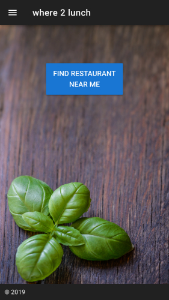

# where2lunch

> This project was done as part of a three days prodject at Code Chrysalis where I had to use a technology I had never used before I chose Nuxt. The result is this simple mobile web app that recommend you a close by restaurant (<= 200 m from your current position).

I got the idea since we always had problem deciding where to eat lucnh.

## Pictures



## Build Setup
This repository uses google maps to fetch close by restaurants. You will because of that need a GOOGLE API key. Save it in the .env file.
``` JavaScript
// .env
GOOGLE_API_KEY="YOUR GOOGLE MAPS API KEY AS A STRING"
```

Install and run the project:
``` bash
# install dependencies
$ npm install

# serve with hot reload at localhost:3000
$ npm run dev

# build for production and launch server
$ npm run build
$ npm start

# generate static project
$ npm run generate
```

For detailed explanation on how things work, checkout [Nuxt.js docs](https://nuxtjs.org).
